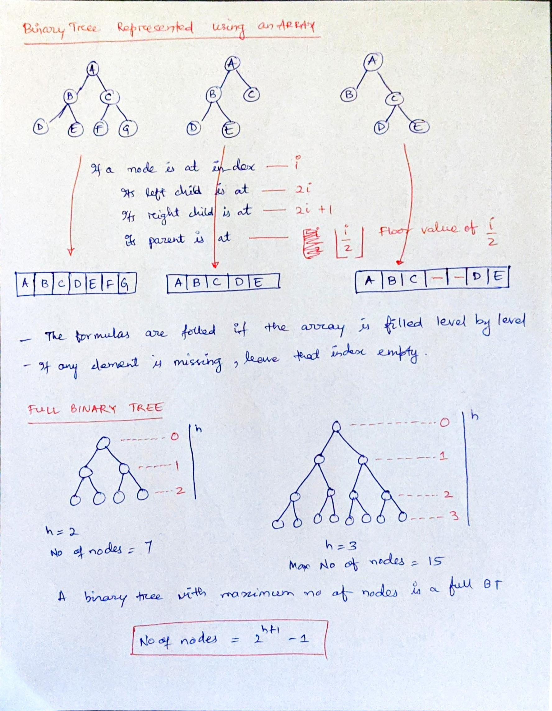
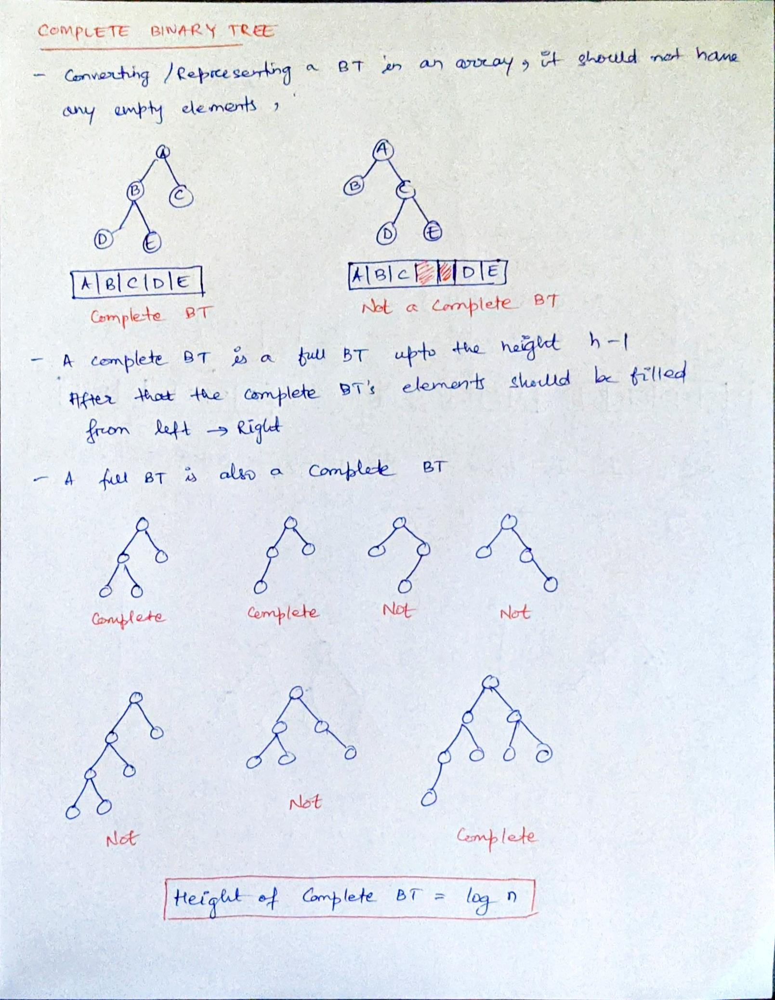
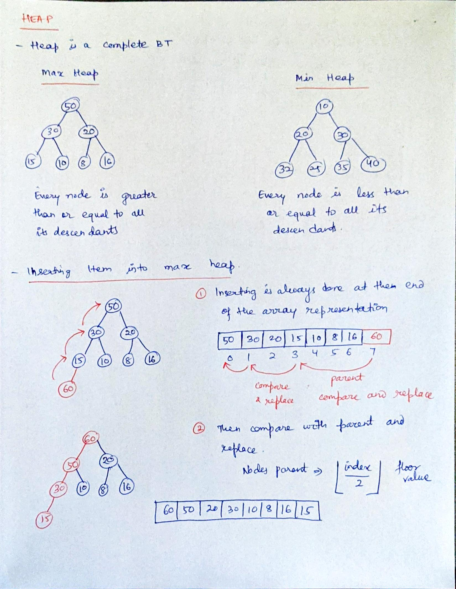
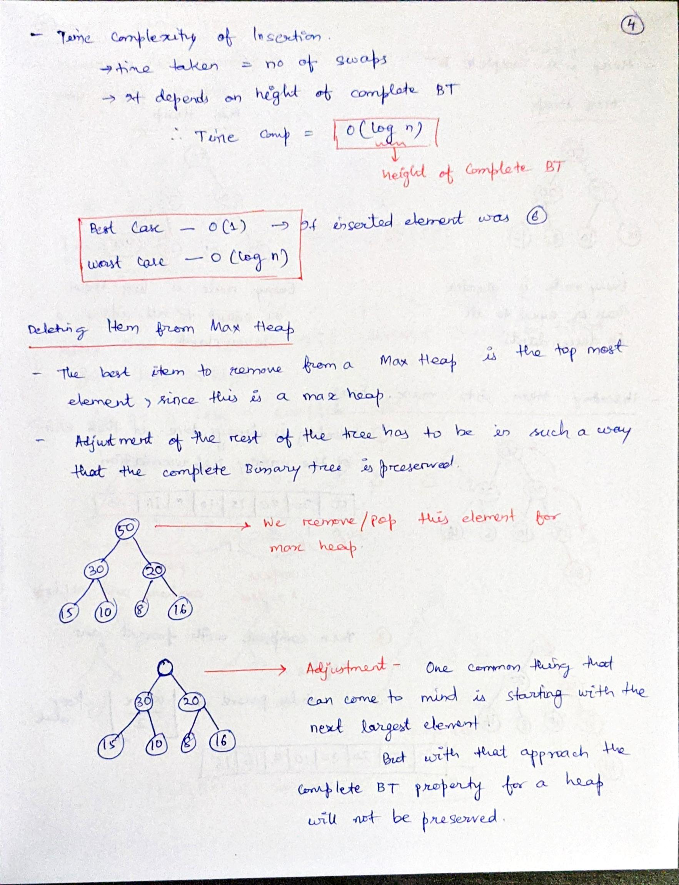
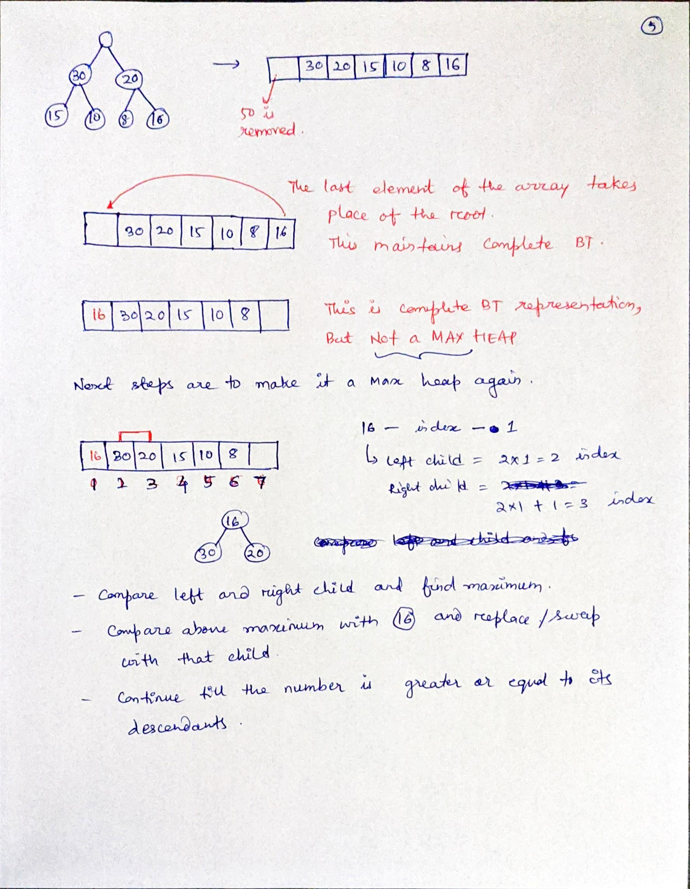

# Heap-in-.Net

# Heap-in-.Net

- Actual code exists in [Data Structure](Heap/DataStructures) folder
- **Heap.cs** is an abstract class with all common methods implemented for Min and Max heaps
- **MinHeap.cs** and **MaxHeap.cs** has individuals implementations of Rearranging ietms after insertion and deletion

### Sources
- [YouTube](https://www.youtube.com/watch?v=HqPJF2L5h9U) tutorial video on Heap, Heap Sort and Priority Queue by Abdul Bari
- Blog [article](https://egorikas.com/max-and-min-heap-implementation-with-csharp/#:~:text=%20Max%20and%20Min%20heap%20implementation%20with%20C%23,a%20few...%204%20Max%20heap.%20%20More%20) by Egor Grishechko 

### Representation of Binary Trees as Arrays

### Complete Binary Tree

## Heap
### Heap - Insertion

### Heap - Deletion

